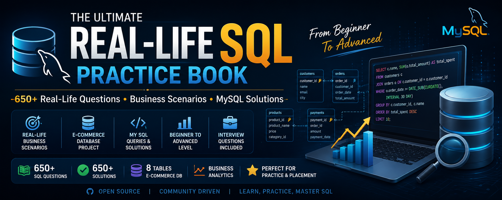

<div align="center">

# 🚀 The Ultimate Real-Life SQL Practice Book



### 📚 650+ Real-Life MySQL Problems & Solutions

**Business Scenarios • Case Studies • Interview Questions • E-commerce Database • Beginner → Advanced**


</div>

---

# 📖 About This Repository

This repository is a complete collection of **650+ real-world MySQL practice problems** designed to help learners progress from **Beginner to Advanced** using a realistic E-commerce database.

Every problem is inspired by practical business scenarios commonly found in industries such as:

- 🛒 E-commerce
- 🏦 Banking
- 📦 Inventory Management
- 📈 Business Analytics
- 🚚 Supply Chain
- 👨‍💼 Customer Relationship Management (CRM)

---

# 🎯 Learning Objectives

By completing this repository, you will learn how to:

- Write efficient SQL queries
- Solve real business problems
- Optimize SQL performance
- Design relational databases
- Build analytical reports
- Prepare for SQL interviews

---

# 📊 Repository Coverage

| Module | Topics | Problems |
|---------|--------|---------:|
| Volume 1 | SQL Basics | 100 |
| Volume 2 | Intermediate SQL | 100 |
| Volume 3 | Joins & Subqueries | 100 |
| Volume 4 | Window Functions & Analytics | 100 |
| Volume 5 | Views, Procedures & Triggers | 100 |
| Volume 6 | Advanced Business Problems | 150+ |

**Total:** **650+ SQL Problems**

---

# 🗂 Repository Structure

```text
Database/
Dataset/
Volume-01/
Volume-02/
Volume-03/
Volume-04/
Volume-05/
Volume-06/
ER-Diagram/
SQL-Scripts/
Assets/
```

---

# 🧠 Topics Covered

- SELECT
- WHERE
- ORDER BY
- GROUP BY
- HAVING
- Aggregate Functions
- String Functions
- Date Functions
- CASE WHEN
- JOINS
- Subqueries
- Common Table Expressions (CTEs)
- Window Functions
- Views
- Stored Procedures
- Triggers
- Transactions
- Indexes
- Business Analytics

---

# 🛠 Database

**Database Name**

```sql
ecommerce_database_data
```

Tables

- Customers
- Employees
- Products
- Orders
- Suppliers
- Inventory
- Payments
- Reviews

---

# ⭐ Who Is This For?

- Students
- Beginners
- Data Analysts
- SQL Developers
- Backend Developers
- Interview Preparation
- College Projects

---

# 🤝 Contributions

Suggestions and improvements are welcome.

If you find this repository useful, consider giving it a ⭐.

---

# 👨‍💻 Author

**Suvam Naskar**

GitHub: https://github.com/naskarsuvam21

LinkedIn: *(Add your LinkedIn profile here)*
