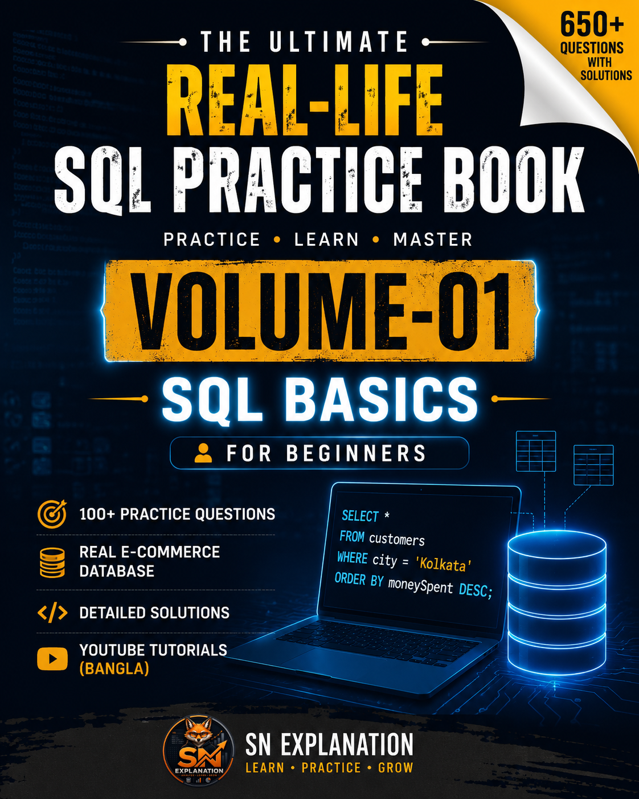
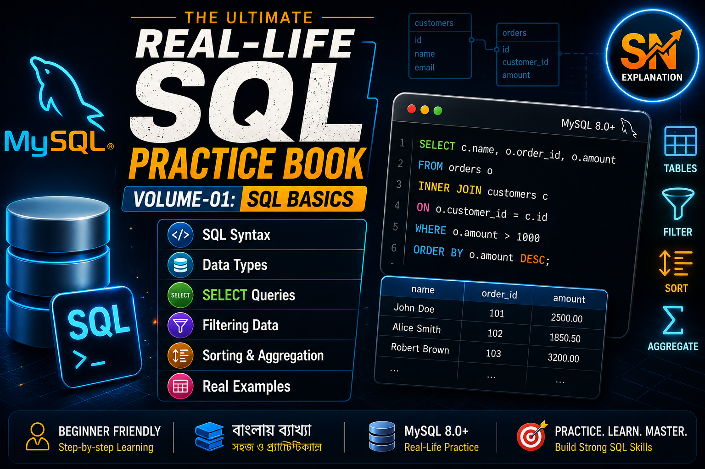

# 📘 Volume-01 — SQL Basics

---

## 📖 About this Volume

Welcome to **Volume-01** of **The Ultimate Real-Life SQL Practice Book**.

This volume is specially designed for complete beginners who want to learn SQL from scratch using a **Real-Life E-Commerce Database**.

Every problem in this volume is based on practical business scenarios instead of random classroom examples.

---

# 🎯 What You'll Learn

✔ SELECT Statement

✔ WHERE Clause

✔ ORDER BY

✔ LIMIT

✔ DISTINCT

✔ Alias (AS)

✔ Arithmetic Operators

✔ Comparison Operators

✔ Logical Operators

✔ IN

✔ BETWEEN

✔ LIKE

✔ IS NULL

✔ Aggregate Functions

- COUNT()
- SUM()
- AVG()
- MIN()
- MAX()

---

# 📂 Files Included

|     File         |         Description                     |
|------------------|-----------------------------------------|
| SQL_Practice.sql | Practice Questions + Complete Solutions |
| Images/          | Preview images                          |
| README.md        | Documentation                           |

---

# 🗂 Database Used

All queries are written using the **Real-Life E-Commerce Database** included in this repository.

Database files are available here:

➡ **Database/**

- Schema.sql
- ecommerce_database_data.sql
- ER_Diagram.png

---

# 📺 YouTube Tutorial

Watch the complete explanation in Bangla.

▶ Episode Playlist

[https://www.youtube.com/playlist?list=YOUR_PLAYLIST_ID](https://www.youtube.com/watch?v=g_tcuPpu-PE&list=PLVlsF7jrOzdQ)

---

# 💡 Difficulty

🟢 Beginner

---

# 🧠 Best Way to Practice

Instead of directly reading the solution,

1. Read the question.
2. Pause the video.
3. Solve it yourself.
4. Compare with the solution.
5. Try writing the query again without looking.

---

# 📸 Preview

---

# 🚀 Next Volume

➡ Volume-02 — Intermediate SQL

Topics:

- GROUP BY
- HAVING
- Aggregate Functions
- Real Business Reports

---

## ⭐ Support the Project

If this repository helps you,

⭐ Star this repository

📺 Subscribe to SN Explanation

💙 Share with your friends

---

Made with ❤️ by **Suvam Naskar** (@snexplanation)

